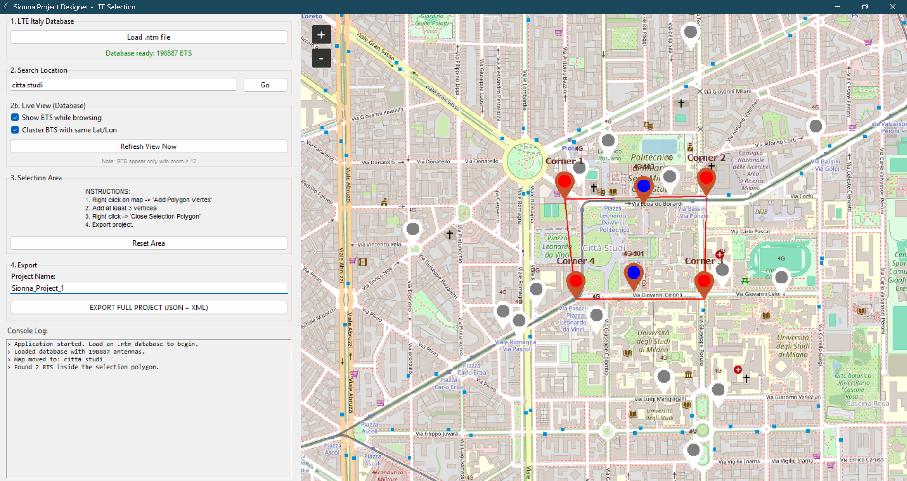
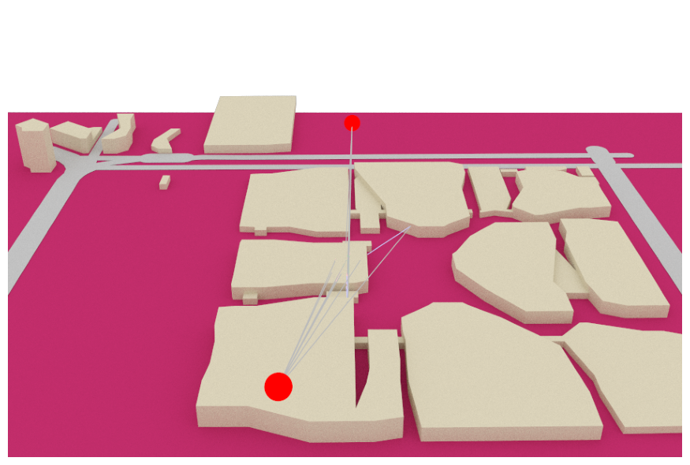

# LTE-italy-SionnaExportTool

Build realistic Sionna RT scenes from OpenStreetMap and LTE Italy data, either with a GUI or with notebooks, then load and visualize the exported scene in Scene-Edit.



## What This Project Does
This toolchain helps you:
- Import an LTE Italy `.ntm` database
- Select an area on a map
- Export a complete Sionna-ready project:
  - scene XML
  - mesh files (`.ply`) for ground/buildings/roads
  - project metadata JSON with selected BTS
- Load and visualize the exported scene in `Scene-Edit-LTE-italy.ipynb`

You can export in two ways:
- GUI app: `gui.py`
- Notebook workflow: `OSM_to_Sionna_LTE-italy.ipynb`

## Project Structure
- `gui.py`: interactive GUI to load DB, select area, export JSON + XML + meshes
- `OSM_to_Sionna_LTE-italy.ipynb`: notebook-based export workflow
- `Scene-Edit-LTE-italy.ipynb`: load latest exported project and visualize scene/BTS
- `tim_20250716_lteitaly.ntm`: LTE Italy database example
- `simple_scene/`: export output root

## Requirements
Use Python 3.10+ (3.11/3.12 recommended).

Install dependencies:

```bash
pip install pandas numpy pyproj shapely osmnx pyvista open3d tkintermapview geopy ipyleaflet ipywidgets ipyvolume sionna
```

Notes:
- `tkinter` is usually included with system Python, but on some Linux distros you may need to install it separately.
- `osmnx` requires internet access for OpenStreetMap queries.

## Quick Start (Fastest)

### Option A: GUI Export (recommended for first try)
1. Run:
   ```bash
   python gui.py
   ```
2. Click `Load .ntm file` and select your LTE Italy `.ntm` database.
3. On the map:
   - Right click -> `Add Polygon Vertex` (add at least 3 points)
   - Right click -> `Close Selection Polygon`
4. (Optional) Enable `Cluster BTS with same Lat/Lon`.
5. Set `Project Name`.
6. Click `EXPORT FULL PROJECT (JSON + XML)`.

### Option B: Notebook Export
1. Open `OSM_to_Sionna_LTE-italy.ipynb`.
2. Edit the `CONFIG` cell (see variables section below).
3. Execute cells top-to-bottom.
4. Draw/select your area in the map cell.
5. Run export cells for ground, buildings, roads, and final XML/JSON save.

## Scene Visualization Workflow
After exporting from GUI or notebook:
1. Open `Scene-Edit-LTE-italy.ipynb`.
2. Run cells from top to bottom.
3. The notebook auto-detects the latest folder in `simple_scene/` and loads:
   - `simple_OSM_scene.xml`
   - project JSON (if present)
4. It places BTS and renders/previews the scene.



## Configurable Variables

### In GUI (`gui.py`)
Main user-facing controls:
- `Project Name` (export folder/file prefix)
- `Cluster BTS with same Lat/Lon` (groups co-located BTS)
- `Show BTS while browsing` (live markers)
- Selection polygon drawn on map

Technical defaults in code:
- Initial map position/zoom
- OSM query timeout/cache settings
- Materials/camera defaults for scene XML

### In Notebook (`OSM_to_Sionna_LTE-italy.ipynb`)
Edit the `CONFIG` dictionary in the configuration cell:
- `map_center_lat`, `map_center_lon`: default map center
- `location_label`: label used in folder naming
- `ntm_db_filename`: LTE database filename
- `project_json_name`: output JSON project name
- `export_project_json`: enable/disable JSON export
- `cluster_colocated_bts`: cluster BTS at same coordinates
- `rt_use_synthetic_bs`: use synthetic BS for RT demo
- `rt_synthetic_bs_count`: number of synthetic BS
- `rt_synthetic_bs_radius_m`: synthetic BS radius from center
- `rt_synthetic_bs_min_height_m`, `rt_synthetic_bs_max_height_m`: synthetic BS height range
- `rt_random_seed`: reproducible RT random seed
- `rt_no_preview`: render image instead of interactive preview

## LTE Italy Database Import
The tool expects a semicolon-separated `.ntm` file (example in repo: `tim_20250716_lteitaly.ntm`).

Parsed columns are:
- `Tech`, `MCC`, `MNC`, `CID`, `v1`, `eNB`, `v2`, `Lat`, `Lon`, `Desc`, `v3`

BTS are filtered by polygon containment and optionally clustered if coordinates are identical.

## BTS Clustering Behavior
When clustering is enabled:
- BTS sharing exact same `Lat/Lon` are merged into one marker/exported item
- Added metadata includes:
  - `cluster_size`
  - `cluster_cids`
- `Tech` may be aggregated (for mixed technologies)

Why useful:
- cleaner map
- reduced duplicate colocated transmitters
- simpler scenario inspection/export

## Output Files and Where They Are Saved
Each export creates:

```text
simple_scene/<project_name>_<center_x>_<center_y>/
  ├─ mesh/
  │   ├─ ground.ply
  │   ├─ building_0.ply, building_1.ply, ...
  │   └─ road_mesh_combined.ply
  ├─ simple_OSM_scene.xml
  └─ <project_name>.json
```

Details:
- `<center_x>_<center_y>` are projected metric coordinates of area centroid
- XML references meshes in the local `mesh/` folder
- JSON stores area polygon, center, EPSG, and selected BTS metadata

## End-to-End Flow Summary
1. Load LTE DB (`.ntm`)
2. Select polygon area
3. Query OSM for buildings and roads
4. Generate meshes (`.ply`)
5. Build Sionna XML scene
6. Export project JSON with BTS
7. Open Scene-Edit notebook and visualize

## Troubleshooting
- No buildings exported:
  - check internet connection (OSM query)
  - verify selected area is valid and not too tiny
  - try another area to exclude missing OSM building data
- Export is slow:
  - large areas can take longer due to OSM + mesh generation
  - reduce polygon size for quick tests
- Scene load errors in Scene-Edit:
  - ensure XML and mesh files are in the same export folder
  - ensure paths in XML point to existing files
- No BTS found:
  - verify `.ntm` loaded correctly
  - ensure polygon overlaps region with LTE entries

## Suggested First Test (2-3 minutes)
1. Run GUI
2. Load `tim_20250716_lteitaly.ntm`
3. Draw a small polygon in Milan
4. Enable clustering
5. Export with project name `quick_test`
6. Open `Scene-Edit-LTE-italy.ipynb` and run all cells

You should see exported BTS and a render/preview of the generated scene.
